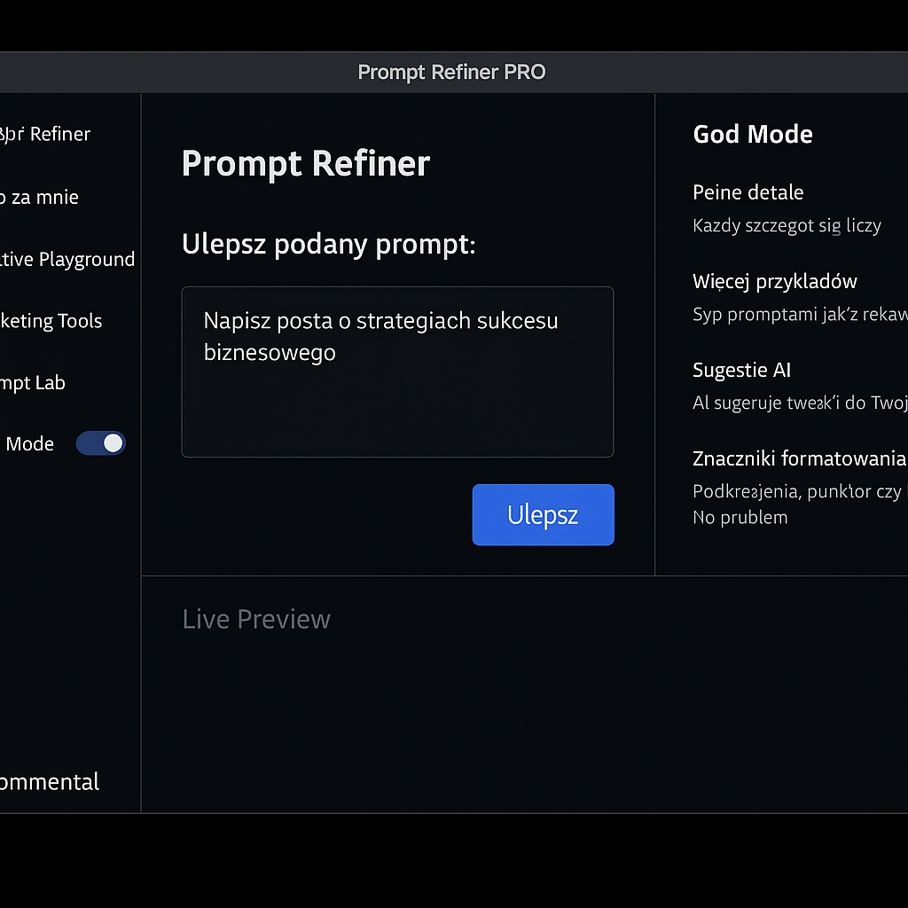
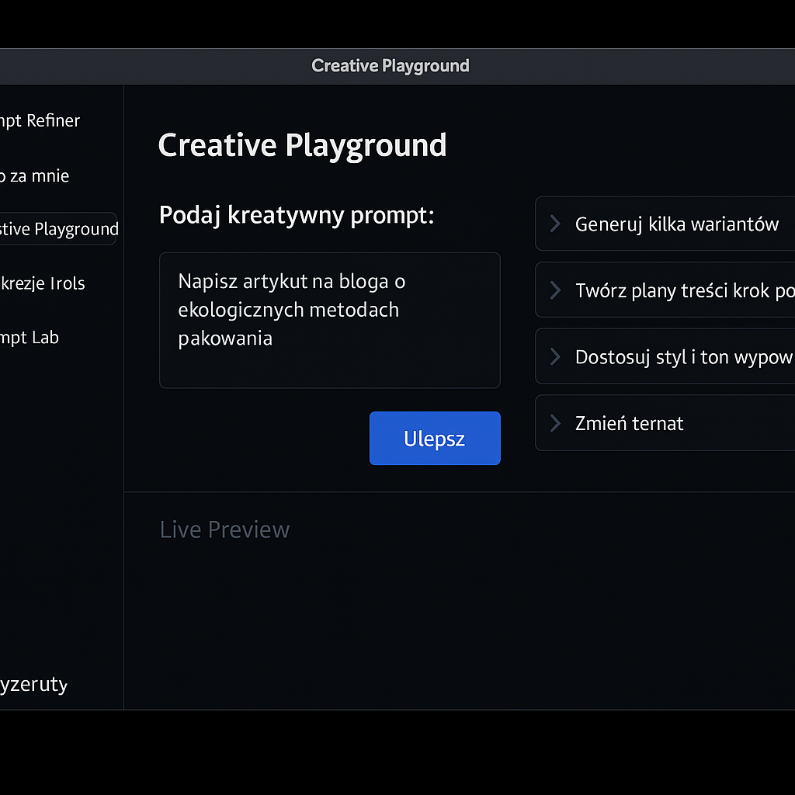

# 🧠 Prompt Refiner PRO

> AI-powered Prompt Management & Creative Assistant – offline, powerful, and ultra-flexible.  
> ✨ Built by [Piotr](https://github.com/bielaster) + ChatGPT

## 🖼️ Screenshots

### 🎨 Creative Playground


### 🧪 Prompt Lab

## 🚀 Features

- 🎯 Prompt Refiner & Live Editor
- 🧠 AI Personas & Adaptive Writing
- 🧪 Prompt Lab (Puzzle, Quest, Mood, Reflection, etc.)
- ✍️ "Do It For Me" Creative Mode
- 📈 Prompt Testing & A/B
- 📢 Marketing Tools (Hashtags, Reach Tips)
- 🌙 Dynamic Day/Night Theme
- 📂 Versioning, Tags, Collections
- 🧩 Modular Presets, Tooltips & Plugins
- 💡 Real-time DALL·E/AI Image Preview

## 🛠️ Installation

```bash
git clone https://github.com/bielaster/Prompt-Refiner-PRO.git
cd Prompt-Refiner-PRO
npm install
npm start
```

## 🔐 API Key Setup

Create `.env` file:

```
REACT_APP_OPENAI_KEY=your_openai_api_key
```

## 🌐 GitHub Pages Landing

Visit: [https://bielaster.github.io/Prompt-Refiner-PRO](https://bielaster.github.io/Prompt-Refiner-PRO)

## 👨‍🔬 Roadmap

See [ROADMAP.md](./ROADMAP.md)

## 🕒 Changelog

See [CHANGELOG.md](./CHANGELOG.md)
